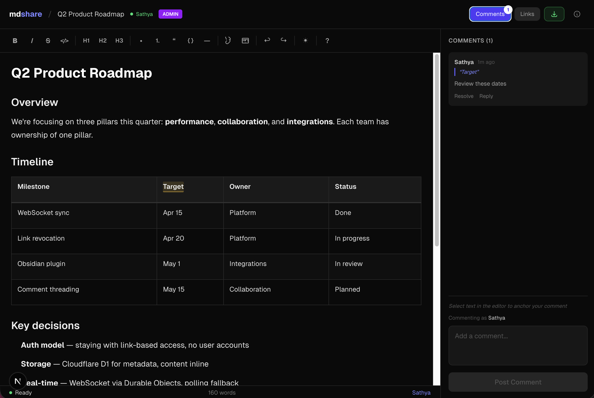

# mdshare

Share markdown instantly. Free. No login required.

[](LICENSE)
[](https://www.npmjs.com/package/mdshare-mcp)
[](https://github.com/urbanmorph/mdshare)
[](https://mdshare.live)

**[mdshare.live](https://mdshare.live)** | **[API Docs](https://mdshare.live/docs)** | **[VS Code](https://mdshare.live/docs#vscode)** | **[Obsidian](https://mdshare.live/docs#obsidian)**



## Quick Start

Paste markdown at [mdshare.live](https://mdshare.live), start from a blank page, or upload via curl:

```bash
curl -X POST https://mdshare.live/api/documents \
  -H "Content-Type: text/markdown" \
  --data-binary @your-file.md
```

You get back an admin URL. Share it, or generate links with different permissions.

[Full API documentation](https://mdshare.live/docs)

## Features

- **Four permission levels** -- Admin, Edit, Comment, View -- each with its own shareable link
- **WYSIWYG editor** -- formatting toolbar, tables, code blocks, keyboard shortcuts
- **Inline comments** -- anchor comments to specific text, reply, and resolve
- **Real-time sync** -- WebSocket collaboration, live presence indicators
- **Link management** -- revoke links instantly, optional expiry, 50-link cap per document
- **VS Code & Obsidian plugins** -- share markdown directly from your editor
- **API & MCP** -- REST API + MCP server for Claude, ChatGPT, Gemini, Cursor, and Windsurf

## MCP Server

```bash
npx mdshare-mcp
```

Say *"upload my-notes.md to mdshare"* in any MCP-compatible AI tool. The MCP server reads files directly from disk (no echoing through the conversation), so it's fast even for large markdown files. [Setup guide](https://mdshare.live/docs#use-with-ai)

## Tech Stack

| Component | Technology |
|-----------|-----------|
| Framework | Astro 5 |
| UI | React (as Astro islands) |
| Hosting | Cloudflare Workers (native) |
| Database | Cloudflare D1 (SQLite) |
| Real-time | Cloudflare Durable Objects (WebSocket) |
| Editor | Tiptap + tiptap-markdown |
| Styling | Tailwind CSS v4 |
| CI/CD | GitHub Actions |

## Local Development

```bash
git clone https://github.com/urbanmorph/mdshare.git
cd mdshare
npm install

# Create a .dev.vars file with your Cloudflare API token
echo "CLOUDFLARE_API_TOKEN=your_token" > .dev.vars

# Apply local D1 migrations
npx wrangler d1 migrations apply mdshare-db --local

# Start dev server
npm run dev -- -p 3737
```

## Contributing

Issues and PRs welcome. Please open an issue first to discuss significant changes.

## License

MIT
